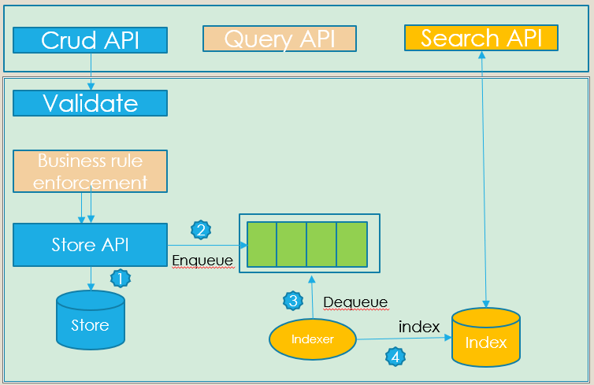
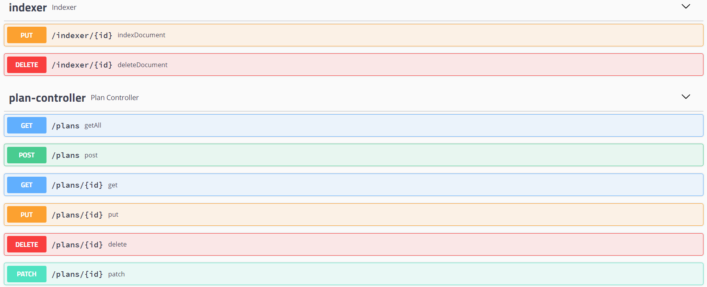

# searchIndex

searchIndex is a highly available concurrent backend systems designing for flexible data structure with build in search functionality
- can handle any structured data in Json
- support for validation
- support for Advanced semantics with rest API operations such as update if not changed; conditional read and conditional write, including merge/Patch support, cascaded delete
- support for Security mechanism using Oauth2 for authentication via Google IDP 
- support synchronization between data store and Elasticsearch index.

## Table of content

- [Installation](#installation)
- [Pre-requisite](#Pre-requisite)
- [System Architecture](#System-Architecture)
- [Available API](#Available-API)
- [Authentication](#Authentication)
- [Json schema Validation](#Json-schema-Validation)
- [Data Modeling](#Data-Modeling)
- [Example Usecase](#Example-Usecase)
- [Elasticsearch](#Elasticsearch)
- [Authors and acknowledgment](#Authors-and-acknowledgment)
- [Contributing](#Contributing)
- [License](#License)


## Installation

- Please open the terminal and execute the command below. Make sure you have installed docker-compose in advance.

```bash
git clone https://github.com/levy0601/searchIndex.git
cd BulletJournal

docker-compose -f ./docker-compose.yml up -d
```
- and then run the spring boot application

```bash
curl -XPUT "http://localhost:9200/plan" -H 'Content-Type: application/json' -d /IndexMapping.json
```


- go to `http://localhost:8080/swagger-ui.html#/`

## Pre-requisite 
- Docker 19.03.5+
- Docker Compose 1.25+ (optional but recommended)
- Redis 5.0.8+
- ElasticSearch 7.6.0+
- Kibana 7.6.0+

## System Architecture


## Available API
- All the API available are list on the swagger page 

- Notice that all 
`/plans` `/indexer`
API require a `id_token` in the header you get from Google IDP

- `/plans` Api 
  * `GET localhost:8080/plans/{planId}` 
    * retrieve the full document with the given `planId`
    * support conditional read with Etag `If-None-Match` implementation
  * `GET localhost:8080/plans` will retrieve the all the documents with store in  redis

  * `PATCH localhost:8080/plans/{planId}` 
    * will update the document with partial document.
    * support Json deep merge
    * support conditional write with Etag `If-Match` implementation

  * `PUT localhost:8080/plans/{planId}` 
    * will update the document with a full, validated json document
    * support conditional write with Etag `If-Match` implementation

  * `DELETE localhost:8080/plans/{planId}` 
    * will delete all the document under the given `planId`
    * support conditional write with Etag `If-Match` implementation
    * support cascaded delete

- `/indexer` Api 
  * `PUT localhost:8080/indexer/{planId}` 
    * will index the document store in redis to Elasticsearch with given `planId`
  * `DELETE localhost:8080/indexer/{planId}` 
    * will deleted the document in Elasticsearch with given `planId`


## Authentication

- In order to retrieve Id token, go to [Google oauthplayground](https://developers.google.com/oauthplayground/)
- use `openid` as the scope
- click on `Exchange authorization code for token`
- retrieve the `id_token` from the payload and use it as a beaver token in your requrest

## Json schema Validation
- Json schema defined in [src/main/resources/schema.json](#Json-schema-Validation)
- change the schema according to your use case

## Data Modeling

JSON document ingested through the ReST API are converted into a collection of key/value pairs to be stored in the NoSQL database
 
## Example Usecase

```json
{
	"planCostShares": {
		"deductible": 2000,
		"_org": "example.com",
		"copay": 23,
		"objectId": "1234vxc2324sdf-501",
		"objectType": "membercostshare"
		
	},
	"linkedPlanServices": [{
		"linkedService": {
			"_org": "example.com",
			"objectId": "1234520xvc30asdf-502",
			"objectType": "service",
			"name": "Yearly physical"
		},
		"planserviceCostShares": {
			"deductible": 10,
			"_org": "example.com",
			"copay": 0,
			"objectId": "1234512xvc1314asdfs-503",
			"objectType": "membercostshare"
		},
		"_org": "example.com",
		"objectId": "27283xvx9asdff-504",
		"objectType": "planservice"
	}, {
		"linkedService": {
			"_org": "example.com",
			"objectId": "1234520xvc30sfs-505",
			"objectType": "service",
			"name": "well baby"
		},
		"planserviceCostShares": {
			"deductible": 10,
			"_org": "example.com",
			"copay": 175,
			"objectId": "1234512xvc1314sdfsd-506",
			"objectType": "membercostshare"
		},
		"_org": "example.com",
		"objectId": "27283xvx9sdf-507",
		"objectType": "planservice"
	}],
	"_org": "example.com,",
	"objectId": "12xvxc345ssdsds-508",
	"objectType": "plan",
	"planType": "inNetwork",
	"creationDate": "12-12-2017"
}

```

## Elasticsearch

### Data modeling

We choose to ues `parent-child` Relationship to address multi-level nest object in our document.

The parent-child functionality allows you to associate one document type with another, in a one-to-many relationship—​one parent to many children. The advantages that parent-child has over nested objects are as follows:

The parent document can be updated without reindexing the children.
Child documents can be added, changed, or deleted without affecting either the parent or other children. This is especially useful when child documents are large in number and need to be added or changed frequently.
Child documents can be returned as the results of a search request.

### Index Mapping

```json
{
  "mappings": {
    "properties": {
      "objectId": {
        "type": "keyword"
      },
      "plan_service": {
        "type": "join",
        "relations": {
          "plan": [
            "planCostShares",
            "linkedPlanServices"
          ],
          "linkedPlanServices": [
            "linkedService",
            "planserviceCostShares"
          ]
        }
      }
    }
  }
}
```


## Authors and acknowledgment
- Hao Liu - Initial work

## Contributing
Pull requests are welcome. For major changes, please open an issue first to discuss what you would like to change.

Please make sure to update tests as appropriate.

## License
[MIT](https://choosealicense.com/licenses/mit/)